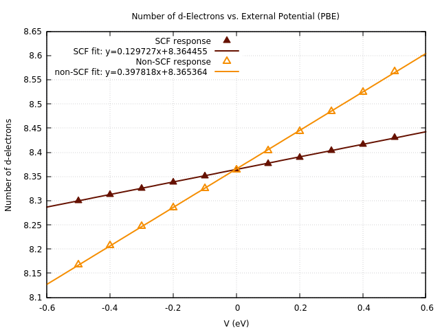

# nio-hubbard-u

Use [calculate_hubbard_u.sh](calculate_hubbard_u.sh) to obtain linear response data. Use [fit_plot_pbe.gnup](fit_plot_pbe.gnup) and  [fit_plot_lda.gnup](fit_plot_lda.gnup) to plot responses.

<h2>Results</h2>

At PBE Level, U = 5.19476817552149 eV.

